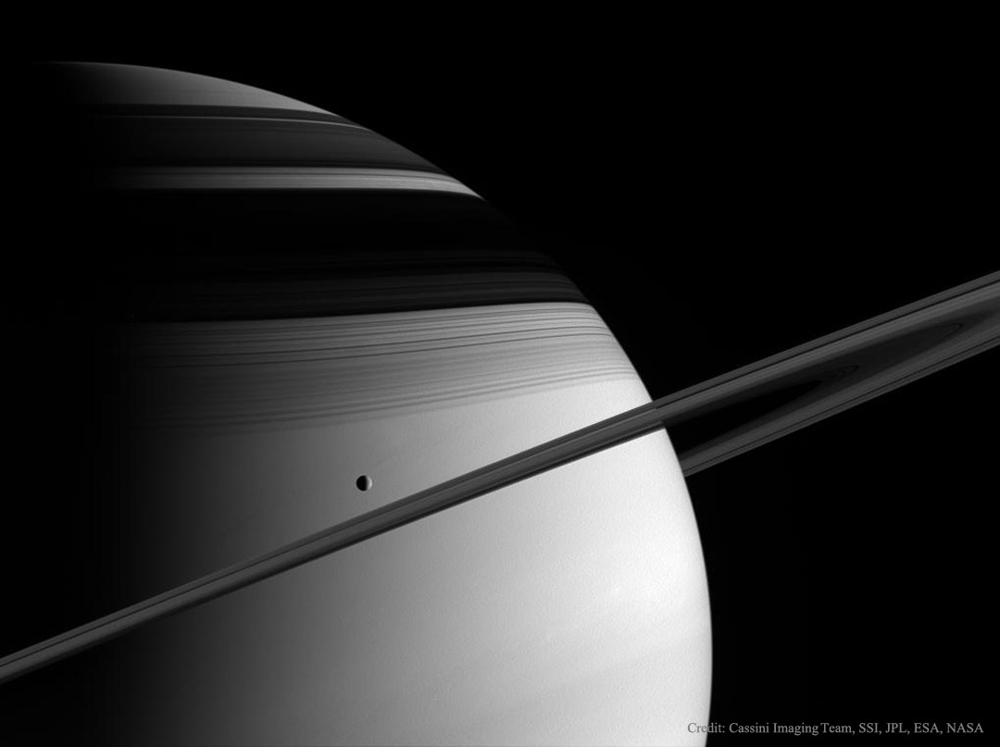

# Saturn, Tethys, Rings, and Shadows

_2022-01-23_

_Public Domain image courtesy of NASA_

Seen from ice moon Tethys, rings and shadows would display fantastic views of the Saturnian system. Haven't dropped in on Tethys lately? Then this gorgeous ringscape from the Cassini spacecraft will have to do for now. Caught in sunlight just below and left of picture center in 2005, Tethys itself is about 1,000 kilometers in diameter and orbits not quite five saturn-radii from the center of the gas giant planet. At that distance (around 300,000 kilometers) it is well outside Saturn's main bright rings, but Tethys is still one of five major moons that find themselves within the boundaries of the faint and tenuous outer E ring. Discovered in the 1980s, two very small moons Telesto and Calypso are locked in stable along Tethys' orbit. Telesto precedes and Calypso follows Tethys as the trio circles Saturn.